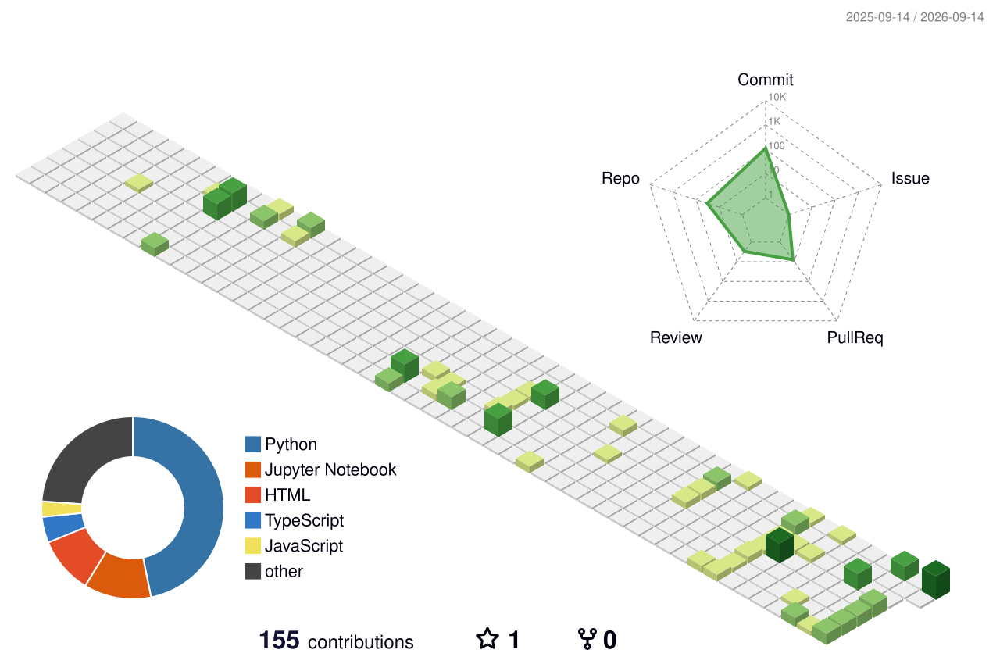

  

  **Mathematics & Computer Science student at [JKUAT](https://www.jkuat.ac.ke/)**  
  Focused on turning messy data into clear decisions.

  
  
  
  

---

### About me

- Studying **Mathematics & Computer Science** at **Jomo Kenyatta University of Agriculture and Technology**
- Building skills in **Data Science**, **Machine Learning**, and **Data Analytics**
- Currently working with **Python** and **PyTorch** to train and evaluate models
- Curious about **decentralized systems** and **sustainable tech**
- Always happy to connect — reach me on [LinkedIn](https://linkedin.com/in/mary-wangui-8237712b6/) or [email](mailto:mwangimarie43@gmail.com)

---

### Highlighted projects

End-to-end analytics work I am proud to share. Each card links to the repo.

<table>
  <tr>
    <td valign="top" width="50%">
      <h3><a href="https://github.com/mwangimarie43-art/FUTURE_DS_02">Telco Customer Churn Analysis</a></h3>
      
End-to-end study of <strong>7,043 IBM Telco customers</strong>: cleaning in Python, churn rates across 8 dimensions, K-means segmentation into 7 groups, and a 2-page Power BI dashboard with retention recommendations.

      

        
        
        
      

    </td>
    <td valign="top" width="50%">
      <h3><a href="https://github.com/mwangimarie43-art/superstore-sales-analysis">Superstore Sales Analysis</a></h3>
      
Sales performance analysis on <strong>9,994 Superstore transactions (2014–2017)</strong>. Python (Pandas, Matplotlib, Seaborn) plus an interactive Power BI dashboard covering revenue, profit, discounts, and regional trends.

      

        
        
        
      

    </td>
  </tr>
  <tr>
    <td valign="top" width="50%">
      <h3><a href="https://github.com/mwangimarie43-art/Employee-Management_System">Employee Management System</a></h3>
      
A <strong>Django</strong> web app for managing employee records — models, forms, views, and templates with SQLite, covering the full CRUD workflow from the admin and user-facing pages.

      

        
        
        
      

    </td>
    <td valign="top" width="50%">
      <h3><a href="https://github.com/mwangimarie43-art/python">Excel &amp; Power BI Data Cleaning</a></h3>
      
Hands-on practice cleaning and exploring an HR dataset in <strong>Excel and Power BI</strong> — formatting, formulas, pivot tables, charts, and dashboard work — alongside Python fundamentals.

      

        
        
        
      

    </td>
  </tr>
</table>

---

### Tech stack

**Languages**  

**Data science & ML**  

**Analytics & tools**  

---

### GitHub stats

  <picture>
    <source media="(prefers-color-scheme: dark)" srcset="https://github-readme-stats.vercel.app/api?username=mwangimarie43-art&show_icons=true&include_all_commits=true&count_private=true&hide_border=true&theme=tokyonight" />
    <source media="(prefers-color-scheme: light)" srcset="https://github-readme-stats.vercel.app/api?username=mwangimarie43-art&show_icons=true&include_all_commits=true&count_private=true&hide_border=true&theme=default" />
    
  </picture>
  <picture>
    <source media="(prefers-color-scheme: dark)" srcset="https://github-readme-stats.vercel.app/api/top-langs/?username=mwangimarie43-art&layout=compact&hide_border=true&langs_count=6&theme=tokyonight" />
    <source media="(prefers-color-scheme: light)" srcset="https://github-readme-stats.vercel.app/api/top-langs/?username=mwangimarie43-art&layout=compact&hide_border=true&langs_count=6&theme=default" />
    
  </picture>
   
  <picture>
    <source media="(prefers-color-scheme: dark)" srcset="https://streak-stats.demolab.com?user=mwangimarie43-art&hide_border=true&theme=tokyonight" />
    <source media="(prefers-color-scheme: light)" srcset="https://streak-stats.demolab.com?user=mwangimarie43-art&hide_border=true&theme=default" />
    
  </picture>

---

### Contribution snake

  
  

### 3D contribution graph

  <picture>
    <source media="(prefers-color-scheme: dark)" srcset="./profile-3d-contrib/profile-night-green.svg" />
    <source media="(prefers-color-scheme: light)" srcset="./profile-3d-contrib/profile-green.svg" />
    
  </picture>

---

  Thanks for stopping by — let’s learn and build together.

